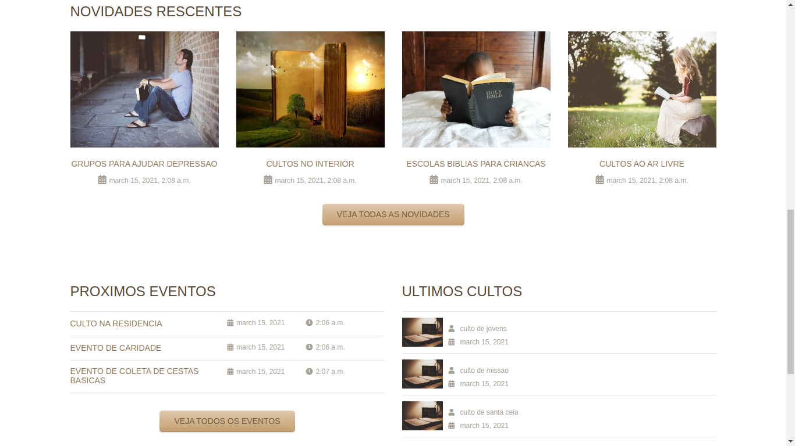
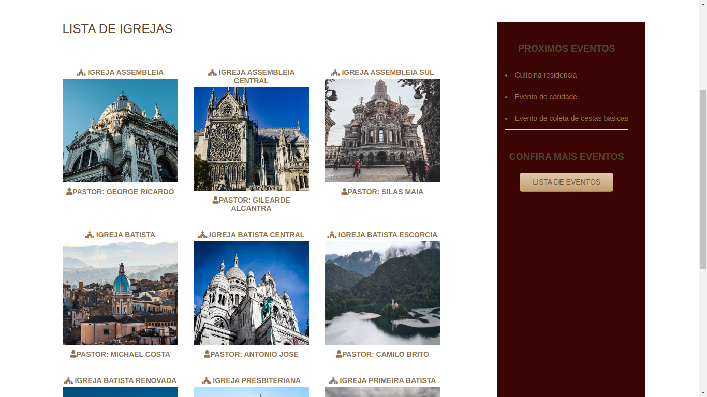
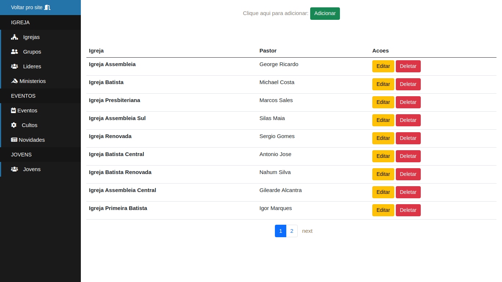

# Igreja

My first project write in python

First Step:

    pip install -r requirements-dev.txt
        
Second Step:

    rename the .env.sample file to .env and run:

Third Step:

    python manage.py migrate

Fourth Step:

    python3 manage.py createsuperuser
  
    
Finally

    run a command python3 manage.py runserver
    
# OBS :
( Se você tiver docker instalado pode rodar esse projeto com o comando "docker-compose up -d --build" )
    
   
# Layout Eventos

# Layout Igrejas

# Layout Dashboard

